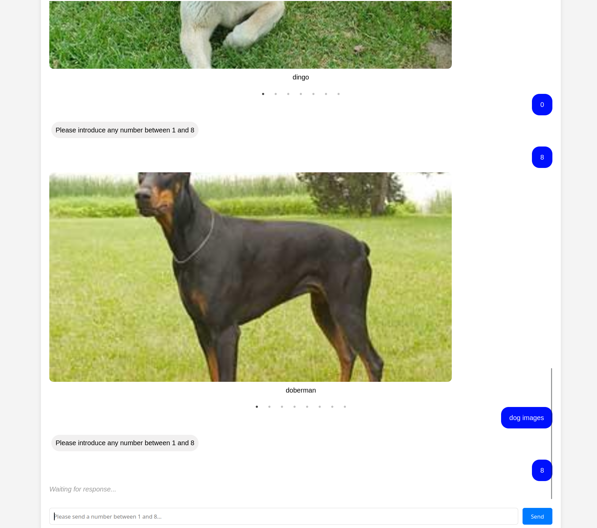

# AI Web Chatbot for Dog Images

## Description

This project was created for a programming challenge for an interview, intended to showcase my skills. This AI style web chatbot allows users to request a random set of dog images by entering a number from 1 to 8. The application is a full-stack project with a Python Flask backend, a Vue.js frontend, and a PostgreSQL database.

The demo screenshot:


## Features

- This is a web chatbot project akin to an AI chatbot, with a user interface experience similar to that of AI platforms like ChatGPT.
- Accepts any user input, but only numbers from 1 to 8 are considered valid.
- Returns the requested number of random dog images in a swiper/slider format.
- Invalid inputs result in a message prompting the user to enter a valid number.
- Saves all user inputs, execution time, results, and a boolean indicating input validity.
- Displays the entire chat history with response times not exceeding 3 seconds.
- Ensures that all dog breeds returned in a single request are unique.
- Allows users to view images in fullscreen mode with a blurred background.

## Technical Stack

- **Frontend**: Vue.js
- **Backend**: Python Flask
- **Database**: PostgreSQL
- **Containerization**: Docker

## Deployment

The application is containerized using Docker.

### Running Locally

To run the application locally, you need to have Docker and Docker Compose installed. Once installed, you can clone the repository and start the application using the following commands:

```bash
git clone https://github.com/gitercn/ai-chatbot-demo.git
cd ai-chatbot-demo
docker-compose up --build
```

The application will be accessible at `http://localhost:8080` for the frontend and `http://localhost:5000` for the backend.

## API Reference

The application uses the [Dog CEO's Dog API](https://dog.ceo/dog-api/) to fetch random dog images. The API returns a JSON object with the image URL and status.

Example API response:

```json
{
    "message": "https://images.dog.ceo/breeds/coonhound/n02089078_2106.jpg",
    "status": "success"
}
```

The dog breed can be identified from the URL path.
